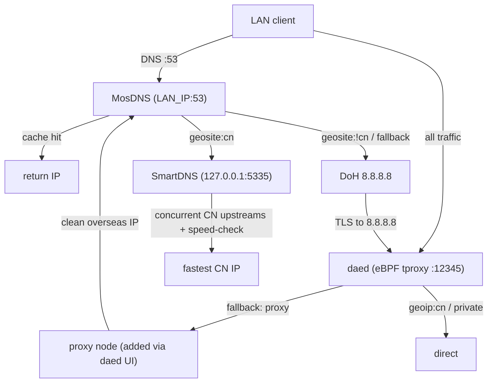

# VyOS 1.5 daed Gateway OVA

An immutable VyOS 1.5 routing appliance (OVA) that integrates an eBPF transparent
proxy (`daed`) with a dual-engine DNS stack: `MosDNS` (front desk) + `SmartDNS`
(CN resolver). Built reproducibly with Packer.

## Architecture



## DNS Data Flow

1. **L1 — daed (eBPF enforcer).** LAN clients sending DNS to the gateway's own
   `:53` are allowed (`must_direct`); DNS to any *other* server (`:53`/`:853`) is
   blocked, preventing DNS escape.
2. **L2 — MosDNS (front desk, `LAN_IP:53`).** Cache hits return instantly.
   `geosite:cn` domains go to SmartDNS; `geosite:!cn` and fallback go to DoH
   `https://8.8.8.8/dns-query`.
3. **L3 — resolution.** CN: SmartDNS queries multiple mainland upstreams
   concurrently and speed-selects the fastest IP (daed lets SmartDNS egress
   directly). Overseas: MosDNS's TLS query to 8.8.8.8 is intercepted by daed and
   tunneled through your proxy node, returning an uncontaminated IP.
4. **L4 — return.** MosDNS caches the result and answers the client.

## First Boot — IMPORTANT

The image ships with **no proxy node**. Until you add one, daed's
`fallback: proxy` has nowhere to send overseas traffic, so **all overseas traffic
(and overseas DNS via DoH) is blackholed**. Mainland sites keep working.

To make overseas traffic work:

1. Open the daed dashboard:
   ```text
   http://<gateway-ip>:2023
   ```
2. Create the daed admin user.
3. Add a proxy node / subscription and select it for the default group.

The LAN IP is bound at boot by a late-bind script — the image never hard-codes an
IP or binds `0.0.0.0`.

## Runtime Layout

```text
/config/custom-services/bin/{daed,mosdns,smartdns}
/config/custom-services/daed/config.dae          # rendered from .template each boot
/config/custom-services/mosdns/config.yaml        # rendered from .template each boot
/config/custom-services/smartdns/smartdns.conf
/config/custom-services/geo/{geoip.dat,geosite.dat,geolocation-cn.txt,geolocation-!cn.txt}
/config/custom-services/scripts/{custom-services-latebind.sh,geosite-update.sh}
```

Services: `daed.service`, `mosdns.service`, `smartdns.service`,
`custom-services-latebind.service` (oneshot at boot), `geosite-update.timer` (weekly).

## Building

GitHub Actions → **Build VyOS 1.5 daed Gateway OVA** → **Run workflow**. Inputs:

- `base_iso_url`: optional prebuilt VyOS 1.5 x86_64 ISO; empty builds circinus/1.5
  from `dd010101/vyos-jenkins`.
- `daed_version`: a daed tag or `latest`.
- `disk_size`: virtual disk size in MB (default `8192`).

Download the `vyos15-daed-gateway-ova` artifact when the run finishes.

## Geosite Updates

`geosite-update.timer` refreshes the MosDNS `geolocation-cn.txt` /
`geolocation-!cn.txt` lists weekly. The updater aborts if a downloaded list has
fewer than 1000 lines, so a bad download never breaks DNS routing.

## Local Verification

```powershell
powershell -NoProfile -ExecutionPolicy Bypass -File tests/smoke.ps1
```

Shell syntax checks:

```bash
bash -n packer/scripts/setup-gateway.sh
bash -n packer/custom-services/scripts/custom-services-latebind.sh
bash -n packer/custom-services/scripts/geosite-update.sh
```

Full `packer validate` and the OVA build run in GitHub Actions.

## Known Limitation

`daed/config.dae` includes `dip(doh.pub) -> must_direct`. dae's `dip()` normally
matches IP/CIDR/geoip, not domains; this rule must be confirmed with
`daed validate` on a booted OVA. If it errors, replace with
`domain(suffix:doh.pub)` or pin doh.pub's fixed IPs.
