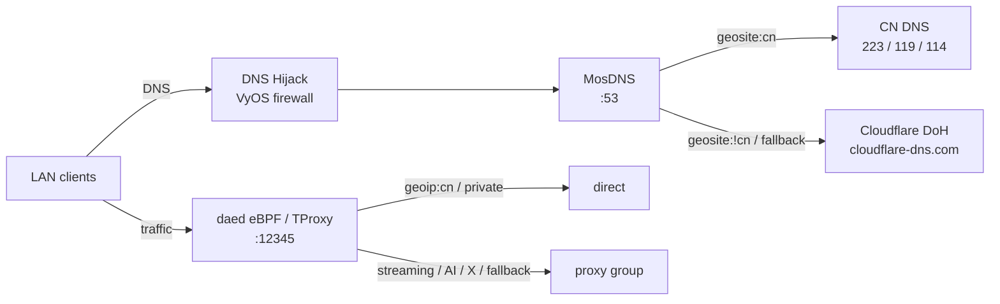

# VyOS 1.5 daed Gateway

自用 VyOS 1.5 旁路由 Golden Image v1：`MosDNS + daed + DNS Hijack`。

目标是做成 boot-ready 镜像：安装后开机自动进入旁路由增强模式，默认启用 MosDNS、daed、DNS 防泄漏和基础网络调优。

## 目标

这不是手工配置记录，而是一套可重复构建的 VyOS 镜像工程。镜像启动后应自动具备：

- MosDNS 作为唯一 DNS 引擎。
- DNS Hijack 自动拦截 LAN 侧 TCP/UDP 53。
- LAN 侧 DoT 853 默认拒绝。
- daed 只负责 eBPF/TProxy 流量分流，不接管 DNS。
- IPv6 默认关闭策略需要在镜像级落地。
- BBR + fq 网络调优需要在镜像级落地。
- SmartDNS 不参与本架构。

## 拓扑

```text
LAN Clients
  |
  v
DNS Hijack (VyOS firewall)
  |
  v
MosDNS(<LAN_BIND_IP>:53)
  |-- geosite:cn  -> 223.5.5.5 / 119.29.29.29 / 114.114.114.114
  `-- geosite:!cn -> cloudflare-dns.com/dns-query (DIRECT WAN)

LAN Traffic
  |
  v
daed eBPF / TProxy
  |-- geoip:cn / private -> direct
  `-- YouTube / Netflix / AI / X / fallback -> proxy
```



## 开机行为

开机后 `late-bind.sh` 会自动完成编排：

1. 探测 LAN IPv4 地址。
2. 渲染 MosDNS 监听地址 `<LAN_BIND_IP>:53`。
3. 安装 DNS Hijack nftables 规则。
4. 连接 daed 的 `geoip.dat` / `geosite.dat`。
5. 启动 `mosdns.service` 和 `daed.service`。

DNS Hijack 使用独立 nftables 表 `inet daed_dns_hijack`。它会把 LAN 侧 TCP/UDP 53 重定向回本机 MosDNS，并拒绝 LAN 侧 TCP/UDP 853，避免设备绕过本机 DNS。

## DNS 策略

MosDNS 是唯一 DNS 策略层。

- `geosite:cn`：走国内 DNS，当前为 `223.5.5.5`、`119.29.29.29`、`114.114.114.114`。
- `geosite:!cn`：走 `https://cloudflare-dns.com/dns-query`。
- 缓存由 MosDNS 负责。
- daed 路由中 `mosdns` 进程为 `must_direct`，避免 DNS 出口依赖代理决策。

## 流量策略

daed 只做流量层分流：

- `geoip:private`：direct。
- `geoip:cn` / `geosite:cn`：direct。
- YouTube、Netflix、AI、X/Twitter：proxy。
- fallback：proxy。

镜像默认不内置代理节点。需要启动海外流量前，先在 daed 面板添加节点并应用配置。

## 目录

```text
/opt/custom-services/
  bin/
    daed
    mosdns
  geo/
    geoip.dat
    geosite.dat
    geolocation-cn.txt
    geolocation-!cn.txt
  daed/
    config.dae
  mosdns/
    config.yaml
    config.yaml.template
  scripts/
    late-bind.sh
    dns-hijack.sh
    geosite-update.sh
  system/
    sysctl.conf
```

源码构建通过 live-build `includes.chroot` 将文件注入到 `/opt/custom-services/`。

## 构建

GitHub Actions 工作流：

```text
Build VyOS 1.5 daed Gateway Image
```

手动运行 workflow 时可设置：

- `daed_version`：daed release tag，或 `latest`。
- `use_china_mirror`：是否使用清华 Debian 镜像。

产物：

- `vyos15-daed-gateway-iso`：主产物，CI 必须产出。
- `vyos15-daed-gateway-ova`：best-effort 可选产物；如果 GitHub Actions 环境无法完成 OVA 转换，构建仍以 ISO 为准。

构建流程会复用项目现有的 VyOS 官方 `vyos/vyos-build:current` 源码构建链路。Golden Image 能力不另起一套目录，而是通过 live-build includes.chroot 和 hooks/live 注入到镜像里。

注入点：

- `data/live-build-config/includes.chroot/opt/custom-services/`：放入 daed、MosDNS、geo 数据、配置模板和脚本。
- `data/live-build-config/includes.chroot/usr/local/bin/`：放入 `daed`、`mosdns` 可执行文件。
- `data/live-build-config/includes.chroot/lib/systemd/system/`：放入 `mosdns.service`、`daed.service`、`late-bind.service`。
- `data/live-build-config/includes.chroot/etc/sysctl.d/99-daed-gateway.conf`：注入 BBR、fq、IPv6 关闭等内核参数。
- `data/live-build-config/hooks/live/99-custom-proxy.chroot`：在 live-build 阶段补权限、模板和开机启用项。

因此当前仓库的结合方式是：现有 VyOS build 负责产出基础 ISO，`packer/custom-services/` 作为 Golden Image 配置源，GitHub Actions 在源码构建时把它注入进镜像。

## 面板

```text
http://<gateway-ip>:2023
```

首次启动生成账号密码：

```bash
sudo cat /config/custom-services/daed/admin-credentials
```

## 网络调优

Golden Image v1 的目标状态包含：

```text
net.core.default_qdisc = fq
net.ipv4.tcp_congestion_control = bbr
net.ipv6.conf.all.disable_ipv6 = 1
net.ipv6.conf.default.disable_ipv6 = 1
```

当前实现已通过 `/etc/sysctl.d/99-daed-gateway.conf` 注入：

- `net.core.default_qdisc=fq`
- `net.ipv4.tcp_congestion_control=bbr`
- `net.ipv6.conf.all.disable_ipv6=1`
- `net.ipv6.conf.default.disable_ipv6=1`

## 验证

脚本语法验证：

```bash
bash -n scripts/late-bind.sh packer/custom-services/scripts/dns-hijack.sh packer/custom-services/scripts/geosite-update.sh scripts/99-custom-proxy.chroot
```
