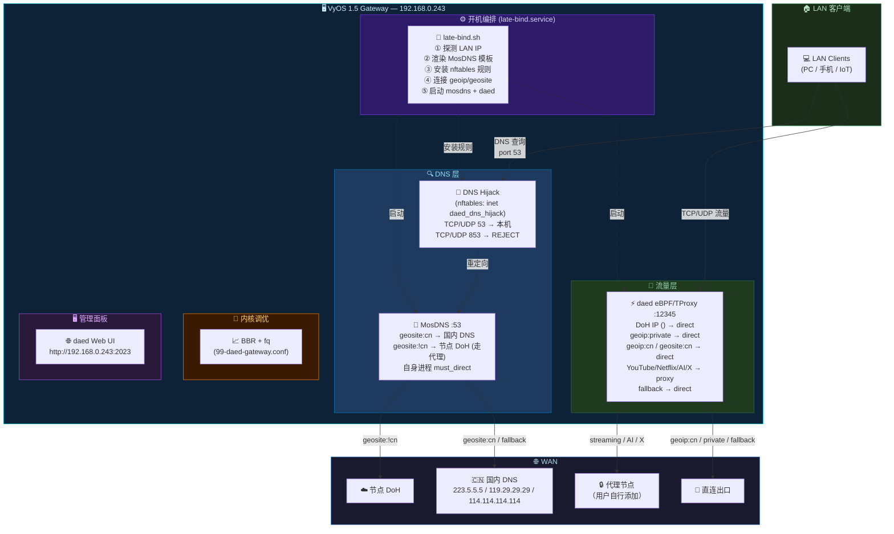
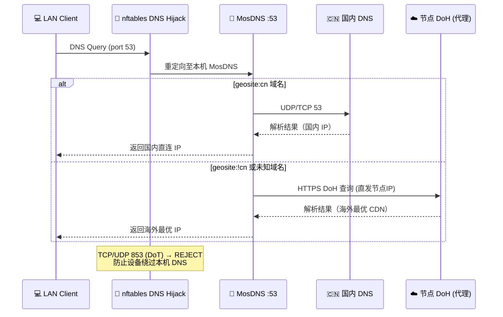
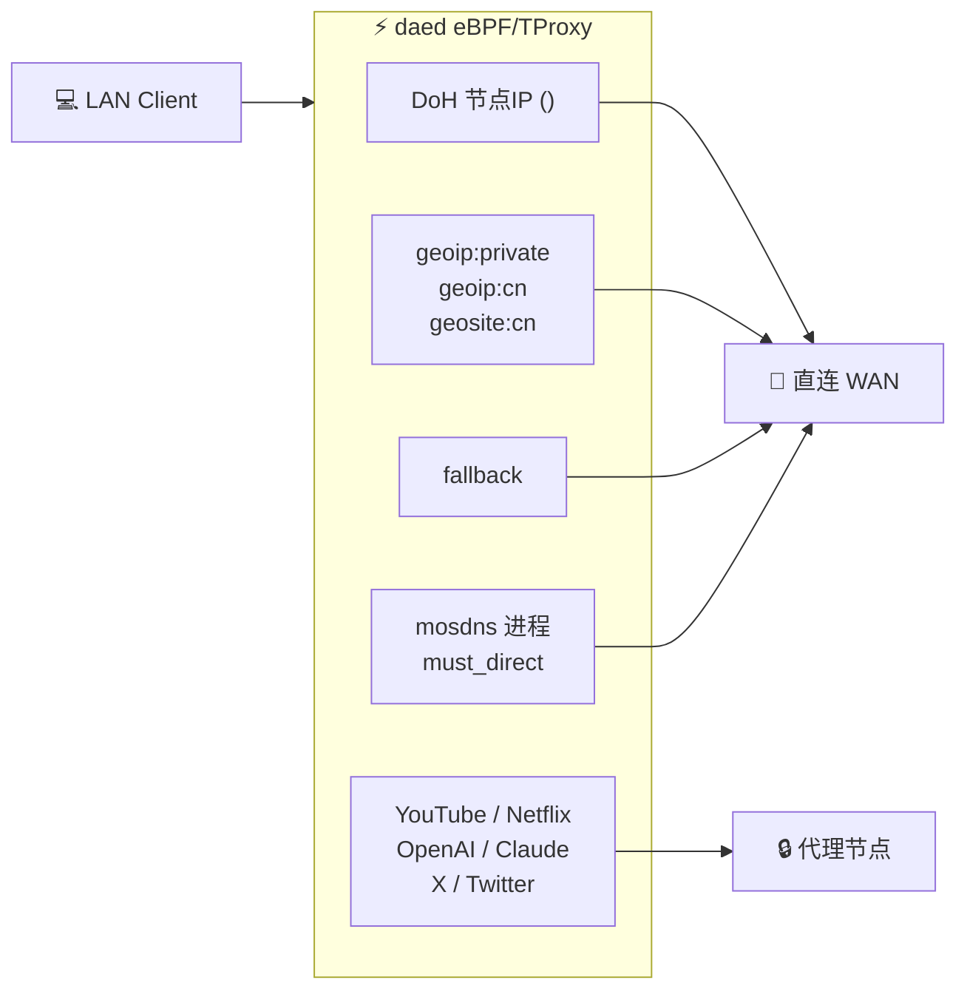

# VyOS 1.5 daed Gateway — 拓扑图

> 主机：`192.168.0.243` | 项目：[kos991/vsd](https://github.com/kos991/vsd)

---

## 整体架构图



---

## DNS 流量详细路径



---

## 数据流量详细路径



---

## 文件系统结构

```text
/opt/custom-services/
├── bin/
│   ├── daed         ← daed 可执行文件
│   └── mosdns       ← MosDNS 可执行文件
├── geo/
│   ├── geoip.dat
│   ├── geosite.dat
│   ├── geolocation-cn.txt
│   └── geolocation-!cn.txt
├── daed/
│   ├── config.dae   ← 流量分流规则
│   └── wing.db      ← 运行时数据（首次启动生成）
├── mosdns/
│   ├── config.yaml
│   └── config.yaml.template  ← 含 <LAN_BIND_IP> 占位符
└── scripts/
    ├── late-bind.sh      ← 开机编排主脚本
    ├── dns-hijack.sh     ← nftables 规则安装
    └── geosite-update.sh ← Geo 数据更新

/lib/systemd/system/
├── daed.service
├── mosdns.service
└── late-bind.service

/etc/sysctl.d/
└── 99-daed-gateway.conf  ← BBR + fq 内核参数
```

---

## 端口与服务汇总

| 服务 | 端口 | 协议 | 说明 |
|------|------|------|------|
| MosDNS | 53 | TCP/UDP | LAN 侧 DNS（由 nftables 劫持转发） |
| daed TProxy | 12345 | TCP/UDP | eBPF/TProxy 透明代理 |
| daed Web UI | 2023 | TCP | 管理面板，访问 `http://192.168.0.243:2023` |
| 节点 DoH | 443 | TCP | 上游 DNS（geosite:!cn 域名） |
| 国内 DNS | 53 | UDP | 223.5.5.5 / 119.29.29.29 / 114.114.114.114 |

---

> [!NOTE]  
> **镜像默认不内置代理节点**，需要在 `http://192.168.0.243:2023` 手动添加节点并应用配置后，海外流量才会正常走代理。
