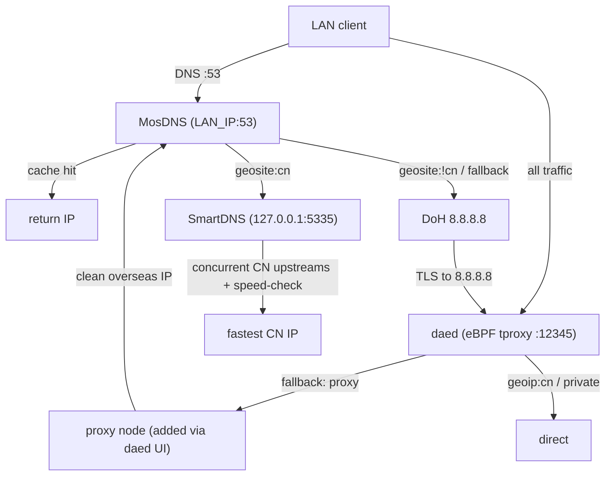

# VyOS + daed + SmartDNS + MosDNS Single-Route Gateway Implementation Plan

> **For agentic workers:** REQUIRED SUB-SKILL: Use superpowers:subagent-driven-development (recommended) or superpowers:executing-plans to implement this plan task-by-task. Steps use checkbox (`- [ ]`) syntax for tracking.

**Goal:** Collapse the repo to a single VyOS 1.5 OVA route that integrates daed (eBPF transparent proxy) with a MosDNS front-desk + SmartDNS CN-resolver dual-engine DNS stack, deleting the legacy Alpine and Debian/PaoPaoDNS routes.

**Architecture:** Packer boots a VyOS 1.5 ISO, `setup-gateway.sh` downloads daed/mosdns/smartdns binaries + geo data and copies committed config templates into `/config/custom-services/`. At boot a late-bind script renders the real LAN IP/subnet into the MosDNS+daed templates and starts the three systemd services. MosDNS serves LAN:53, splits geosite:cn → SmartDNS (concurrent CN upstreams) and geosite:!cn → DoH 8.8.8.8 (tunneled out by daed). daed enforces DNS anti-escape and proxies overseas traffic.

**Tech Stack:** VyOS 1.5 (circinus), Packer + qemu, daed, MosDNS (v5), SmartDNS, systemd, bash, GitHub Actions, PowerShell smoke test.

## Global Constraints

- Configs are physical files under `packer/custom-services/`. NEVER inline configs in Packer HCL or CI YAML.
- MosDNS listens on `<LAN_BIND_IP>:53` (UDP+TCP). NEVER 0.0.0.0.
- SmartDNS binds `127.0.0.1:5335` (and `bind-tcp 127.0.0.1:5335`).
- daed `dns.upstream.local` = `udp://127.0.0.1:5335`; `node {}` stays empty.
- No baked-in proxy nodes, subscriptions, API keys, or secrets in the image.
- Shell scripts use LF line endings (enforced by `.gitattributes`).
- Keep existing repo path conventions: `packer/custom-services/`, `tests/smoke.ps1`. Do NOT move `custom-services/` to repo root.
- daed routing rules MUST be exactly as written in Task 5 (spec author's "MUST exactly be").
- Local env has NO packer/pwsh/shellcheck. `packer validate` is CI-only; local checks use `bash -n` and `powershell.exe`.

## File Structure

| Action | Path | Responsibility |
|--------|------|----------------|
| Delete | `overlay/` | Legacy Alpine OpenRC route |
| Delete | `overlay-debian/` | Legacy Debian/PaoPaoDNS route |
| Delete | `scripts/build-alpine-ova.sh`, `build-debian-ova.sh`, `ci-build-debian-ova.sh`, `ci-build-ova.sh`, `install-daed.sh`, `install-daed-debian.sh`, `install-mini-ppdns.sh`, `render-ovf.sh` | Legacy build scripts |
| Delete | `docs/design.md`, `docs/progress-and-build.md`, `docs/gateway-web-rework-plan.md`, `docs/dae-paopaodns-132-ops.md` | Legacy/old-route docs |
| Keep | `scripts/dae-stability-collector.sh`, `network_diag.sh` | Diagnostics |
| Keep | `packer/build.pkr.hcl` | VyOS qemu build (file provisioner path fix only) |
| Create | `packer/custom-services/mosdns/config.yaml` | MosDNS front desk template |
| Create | `packer/custom-services/smartdns/smartdns.conf` | SmartDNS CN resolver |
| Create | `packer/custom-services/daed/config.dae` | daed eBPF enforcer + tunnel template |
| Create | `packer/custom-services/scripts/custom-services-latebind.sh` | Boot-time LAN IP late-bind + service start |
| Create | `packer/custom-services/scripts/geosite-update.sh` | Weekly geosite list refresh with failsafe |
| Rewrite | `packer/scripts/setup-gateway.sh` | Download bins/geo, copy custom-services, wire systemd |
| Rewrite | `.github/workflows/build-ova.yml` | Drop inline config generation; rely on committed files |
| Rewrite | `tests/smoke.ps1` | Validate VyOS/packer file contract |
| Rewrite | `README.md` | VyOS route, mermaid diagram, firstboot blackhole note |

---

### Task 1: Delete legacy routes and old docs

**Files:**
- Delete: `overlay/` (dir), `overlay-debian/` (dir)
- Delete: `scripts/build-alpine-ova.sh`, `scripts/build-debian-ova.sh`, `scripts/ci-build-debian-ova.sh`, `scripts/ci-build-ova.sh`, `scripts/install-daed.sh`, `scripts/install-daed-debian.sh`, `scripts/install-mini-ppdns.sh`, `scripts/render-ovf.sh`
- Delete: `docs/design.md`, `docs/progress-and-build.md`, `docs/gateway-web-rework-plan.md`, `docs/dae-paopaodns-132-ops.md`

**Interfaces:**
- Consumes: nothing
- Produces: a tree where only `scripts/dae-stability-collector.sh` remains under `scripts/`, and `docs/` holds only `superpowers/`

- [ ] **Step 1: Verify what currently exists**

Run:
```bash
cd "D:/项目工程/daed"
ls scripts/ docs/
ls -d overlay overlay-debian
```
Expected: lists include all delete-targets above.

- [ ] **Step 2: git rm the legacy files and dirs**

```bash
cd "D:/项目工程/daed"
git rm -r overlay overlay-debian
git rm scripts/build-alpine-ova.sh scripts/build-debian-ova.sh \
  scripts/ci-build-debian-ova.sh scripts/ci-build-ova.sh \
  scripts/install-daed.sh scripts/install-daed-debian.sh \
  scripts/install-mini-ppdns.sh scripts/render-ovf.sh
git rm docs/design.md docs/progress-and-build.md \
  docs/gateway-web-rework-plan.md docs/dae-paopaodns-132-ops.md
```

- [ ] **Step 3: Confirm only intended files remain**

Run:
```bash
cd "D:/项目工程/daed"
ls scripts/ ; echo "---" ; ls docs/ ; echo "---" ; git status -s
```
Expected: `scripts/` shows only `dae-stability-collector.sh`; `docs/` shows only `superpowers`; status shows the deletions staged (D) plus the untracked spec/plan files.

- [ ] **Step 4: Commit**

```bash
cd "D:/项目工程/daed"
git add docs/superpowers
git commit -m "refactor: drop alpine/debian routes, keep vyos+packer only"
```

---

### Task 2: SmartDNS CN resolver config

**Files:**
- Create: `packer/custom-services/smartdns/smartdns.conf`

**Interfaces:**
- Consumes: nothing (static config, no templating)
- Produces: SmartDNS listening on `127.0.0.1:5335` udp+tcp — consumed by MosDNS `forward_smartdns` (Task 3) and daed `local` upstream (Task 5)

- [ ] **Step 1: Write the SmartDNS config**

Create `packer/custom-services/smartdns/smartdns.conf`:
```conf
# SmartDNS — CN resolver. Bound to loopback:5335, fronted by MosDNS.
bind 127.0.0.1:5335
bind-tcp 127.0.0.1:5335

cache-size 100000
prefetch-domain yes
serve-expired yes
speed-check-mode tcp:443,icmp

log-level info
log-file /config/custom-services/smartdns/smartdns.log

# Plain UDP mainland upstreams (concurrent, speed-selected)
server 119.29.29.29
server 119.28.28.28
server 223.5.5.5
server 223.6.6.6
server 114.114.114.114
server 114.114.115.115
server 180.76.76.76

# Encrypted mainland upstreams
server-tls 223.5.5.5
server-https https://doh.pub/dns-query
```

- [ ] **Step 2: Syntax sanity check (key/value lines only)**

Run:
```bash
cd "D:/项目工程/daed"
grep -nE '^(bind|bind-tcp|cache-size|prefetch-domain|serve-expired|speed-check-mode|server|server-tls|server-https|log-level|log-file) ' packer/custom-services/smartdns/smartdns.conf | wc -l
```
Expected: `16` (16 directive lines).

- [ ] **Step 3: Commit**

```bash
cd "D:/项目工程/daed"
git add packer/custom-services/smartdns/smartdns.conf
git commit -m "feat: add smartdns cn resolver config"
```

---

### Task 3: MosDNS front-desk config template

**Files:**
- Create: `packer/custom-services/mosdns/config.yaml`

**Interfaces:**
- Consumes: SmartDNS at `127.0.0.1:5335` (Task 2); geosite txt files at `/config/custom-services/geo/geolocation-cn.txt` and `geolocation-!cn.txt` (downloaded in Task 6)
- Produces: `<LAN_BIND_IP>` placeholder rendered by late-bind (Task 7); LAN:53 DNS server consumed by daed routing (Task 5)

- [ ] **Step 1: Write the MosDNS v5 config with `<LAN_BIND_IP>` placeholder**

Create `packer/custom-services/mosdns/config.yaml`:
```yaml
log:
  level: info
  file: "/config/custom-services/mosdns/mosdns.log"

plugins:
  - tag: geosite_cn
    type: domain_set
    args:
      files:
        - "/config/custom-services/geo/geolocation-cn.txt"

  - tag: geosite_noncn
    type: domain_set
    args:
      files:
        - "/config/custom-services/geo/geolocation-!cn.txt"

  - tag: cache
    type: cache
    args:
      size: 8192
      lazy_cache_ttl: 86400

  - tag: forward_smartdns
    type: forward
    args:
      concurrent: 2
      upstreams:
        - addr: "udp://127.0.0.1:5335"
        - addr: "tcp://127.0.0.1:5335"

  - tag: forward_doh
    type: forward
    args:
      upstreams:
        - addr: "https://8.8.8.8/dns-query"

  - tag: main_sequence
    type: sequence
    args:
      - exec: "$cache"
      - matches: "qname $geosite_cn"
        exec: "$forward_smartdns"
      - matches: "qname $geosite_noncn"
        exec: "$forward_doh"
      - exec: "$forward_doh"

servers:
  - exec: main_sequence
    listeners:
      - protocol: udp
        addr: "<LAN_BIND_IP>:53"
      - protocol: tcp
        addr: "<LAN_BIND_IP>:53"
```

- [ ] **Step 2: Verify placeholder + no 0.0.0.0 bind**

Run:
```bash
cd "D:/项目工程/daed"
grep -c '<LAN_BIND_IP>:53' packer/custom-services/mosdns/config.yaml
grep -c '0\.0\.0\.0' packer/custom-services/mosdns/config.yaml
```
Expected: first `2`, second `0`.

- [ ] **Step 3: Commit**

```bash
cd "D:/项目工程/daed"
git add packer/custom-services/mosdns/config.yaml
git commit -m "feat: add mosdns front-desk config with geosite split"
```

---

### Task 4: daed config template (eBPF enforcer + tunnel)

**Files:**
- Create: `packer/custom-services/daed/config.dae`

**Interfaces:**
- Consumes: SmartDNS at `127.0.0.1:5335` (Task 2)
- Produces: `<LAN_SUBNET>` and `<LAN_BIND_IP>` placeholders rendered by late-bind (Task 7)

- [ ] **Step 1: Write the daed config with exact routing rules**

Create `packer/custom-services/daed/config.dae`:
```dae
global {
  log_level: info
  tproxy_port: 12345
  allow_insecure: false
  check_interval: 30s
  check_tolerance: 50ms
  lan_interface: auto
  wan_interface: auto
  auto_config_kernel_parameter: true
}

dns {
  upstream {
    local: 'udp://127.0.0.1:5335'
  }
  routing {
    request {
      fallback: local
    }
  }
}

node {
}

group {
  direct {
    policy: fixed(0)
  }
}

routing {
  dip(114.114.114.114, 114.114.115.115, 119.29.29.29, 119.28.28.28, 180.76.76.76, 223.5.5.5, 223.6.6.6) -> must_direct
  dip(doh.pub) -> must_direct
  sip(<LAN_SUBNET>) && dip(<LAN_BIND_IP>) && dport(53) -> must_direct
  sip(<LAN_SUBNET>) && !dip(<LAN_BIND_IP>) && dport(53, 853) -> block
  dip(geoip:private) -> direct
  dip(geoip:cn) -> direct
  fallback: proxy
}
```

- [ ] **Step 2: Verify exact rules, empty node, placeholders**

Run:
```bash
cd "D:/项目工程/daed"
grep -c 'local:' packer/custom-services/daed/config.dae
grep -c 'fallback: proxy' packer/custom-services/daed/config.dae
grep -c '<LAN_SUBNET>' packer/custom-services/daed/config.dae
grep -c '<LAN_BIND_IP>' packer/custom-services/daed/config.dae
```
Expected: `1`, `1`, `2`, `2`.

- [ ] **Step 3: Add the known-risk note as a code comment ABOVE the doh.pub rule**

Edit `packer/custom-services/daed/config.dae` — change the `dip(doh.pub) -> must_direct` line to be preceded by a comment:
```dae
  # NOTE: dae dip() normally matches IP/CIDR/geoip; dip(<domain>) is per spec author
  # and must be confirmed with `daed validate` on a booted OVA. Fallback if it errors:
  # domain(suffix:doh.pub) or pin doh.pub fixed IPs.
  dip(doh.pub) -> must_direct
```

- [ ] **Step 4: Commit**

```bash
cd "D:/项目工程/daed"
git add packer/custom-services/daed/config.dae
git commit -m "feat: add daed eBPF enforcer config with dns anti-escape routing"
```

---

### Task 5: Late-bind injector script

**Files:**
- Create: `packer/custom-services/scripts/custom-services-latebind.sh`

**Interfaces:**
- Consumes: `mosdns/config.yaml` and `daed/config.dae` templates (Tasks 3,4); reads `/config/custom-services/lan-interface` override file if present
- Produces: rendered `config.yaml`/`config.dae` from `.template` copies; starts `smartdns.service`, `mosdns.service`, `daed.service` (units created in Task 6)

- [ ] **Step 1: Write the late-bind script with a 30s LAN-IP retry loop**

Create `packer/custom-services/scripts/custom-services-latebind.sh`:
```bash
#!/usr/bin/env bash
set -e

BASE="/config/custom-services"
LAN_IF_FILE="${BASE}/lan-interface"

resolve_lan_if() {
  if [ -f "${LAN_IF_FILE}" ]; then
    tr -d '[:space:]' <"${LAN_IF_FILE}"
    return
  fi
  DEFAULT_IF="$(ip route show default 2>/dev/null | awk '{print $5; exit}')"
  CAND="$(
    ip -o -4 addr show scope global |
      awk -v def="${DEFAULT_IF}" '$2 != "lo" && $2 != def {print $2; exit}'
  )"
  echo "${CAND:-${DEFAULT_IF}}"
}

LAN_BIND_IP=""
LAN_SUBNET=""
# Race-condition fix: wait up to 30s for the LAN interface to get a real IPv4.
for _ in $(seq 1 30); do
  LAN_IF="$(resolve_lan_if)"
  if [ -n "${LAN_IF}" ]; then
    LAN_CIDR="$(ip -o -4 addr show dev "${LAN_IF}" scope global | awk '{print $4; exit}')"
    if [ -n "${LAN_CIDR}" ]; then
      LAN_BIND_IP="${LAN_CIDR%/*}"
      LAN_SUBNET="$(ip route show dev "${LAN_IF}" proto kernel scope link | awk '{print $1; exit}')"
      LAN_SUBNET="${LAN_SUBNET:-${LAN_CIDR}}"
      break
    fi
  fi
  sleep 1
done

case "${LAN_BIND_IP}" in
  ""|"0.0.0.0"|"127."*)
    echo "Refusing unsafe or missing LAN bind address: '${LAN_BIND_IP}'" >&2
    exit 1
    ;;
esac

# Render real LAN address every boot; never bake an IP or bind 0.0.0.0 into the image.
sed \
  -e "s|<LAN_BIND_IP>|${LAN_BIND_IP}|g" \
  -e "s|<LAN_SUBNET>|${LAN_SUBNET}|g" \
  "${BASE}/mosdns/config.yaml.template" >"${BASE}/mosdns/config.yaml"

sed \
  -e "s|<LAN_BIND_IP>|${LAN_BIND_IP}|g" \
  -e "s|<LAN_SUBNET>|${LAN_SUBNET}|g" \
  "${BASE}/daed/config.dae.template" >"${BASE}/daed/config.dae"

ln -sf "${BASE}/geo/geoip.dat" "${BASE}/daed/geoip.dat"
ln -sf "${BASE}/geo/geosite.dat" "${BASE}/daed/geosite.dat"

systemctl daemon-reload
systemctl enable smartdns.service mosdns.service daed.service
systemctl restart smartdns.service
systemctl restart mosdns.service
systemctl restart daed.service
```

- [ ] **Step 2: Bash syntax check**

Run:
```bash
cd "D:/项目工程/daed"
bash -n packer/custom-services/scripts/custom-services-latebind.sh && echo OK
```
Expected: `OK`.

- [ ] **Step 3: Verify the 30s retry loop and unsafe-bind guard exist**

Run:
```bash
cd "D:/项目工程/daed"
grep -c 'seq 1 30' packer/custom-services/scripts/custom-services-latebind.sh
grep -c 'Refusing unsafe' packer/custom-services/scripts/custom-services-latebind.sh
```
Expected: `1` and `1`.

- [ ] **Step 4: Commit**

```bash
cd "D:/项目工程/daed"
git add packer/custom-services/scripts/custom-services-latebind.sh
git commit -m "feat: add late-bind injector with lan-ip retry loop"
```

---

### Task 6: Geosite updater script + systemd timer stubs

**Files:**
- Create: `packer/custom-services/scripts/geosite-update.sh`

**Interfaces:**
- Consumes: network access to Loyalsoldier release; writes `/config/custom-services/geo/geolocation-cn.txt` and `geolocation-!cn.txt`
- Produces: `geosite-update.service` + `geosite-update.timer` unit text emitted by `setup-gateway.sh` (Task 7); reloads `mosdns.service`

- [ ] **Step 1: Write the geosite updater with >1000-line failsafe**

Create `packer/custom-services/scripts/geosite-update.sh`:
```bash
#!/usr/bin/env bash
set -e

GEO_DIR="/config/custom-services/geo"
BASE_URL="https://github.com/Loyalsoldier/v2ray-rules-dat/releases/latest/download"
MIN_LINES=1000

mkdir -p "${GEO_DIR}"
tmp_cn="$(mktemp)"
tmp_noncn="$(mktemp)"
trap 'rm -f "${tmp_cn}" "${tmp_noncn}"' EXIT

curl -fL --retry 5 --retry-delay 3 "${BASE_URL}/geolocation-cn.txt" -o "${tmp_cn}"
curl -fL --retry 5 --retry-delay 3 "${BASE_URL}/geolocation-!cn.txt" -o "${tmp_noncn}"

cn_lines="$(wc -l <"${tmp_cn}")"
noncn_lines="$(wc -l <"${tmp_noncn}")"

# Failsafe: refuse to install short/empty lists that would break DNS routing.
if [ "${cn_lines}" -lt "${MIN_LINES}" ] || [ "${noncn_lines}" -lt "${MIN_LINES}" ]; then
  echo "Geosite lists too short (cn=${cn_lines}, noncn=${noncn_lines}); aborting." >&2
  exit 1
fi

install -m 0644 "${tmp_cn}" "${GEO_DIR}/geolocation-cn.txt"
install -m 0644 "${tmp_noncn}" "${GEO_DIR}/geolocation-!cn.txt"

if systemctl is-active --quiet mosdns.service; then
  systemctl reload mosdns.service || systemctl restart mosdns.service
fi

echo "Geosite lists updated (cn=${cn_lines}, noncn=${noncn_lines})."
```

- [ ] **Step 2: Bash syntax check + failsafe presence**

Run:
```bash
cd "D:/项目工程/daed"
bash -n packer/custom-services/scripts/geosite-update.sh && echo OK
grep -c 'MIN_LINES=1000' packer/custom-services/scripts/geosite-update.sh
grep -c 'too short' packer/custom-services/scripts/geosite-update.sh
```
Expected: `OK`, `1`, `1`.

- [ ] **Step 3: Commit**

```bash
cd "D:/项目工程/daed"
git add packer/custom-services/scripts/geosite-update.sh
git commit -m "feat: add geosite updater with line-count failsafe"
```

---

### Task 7: Rewrite setup-gateway.sh (Packer provisioner)

**Files:**
- Modify (rewrite): `packer/scripts/setup-gateway.sh`

**Interfaces:**
- Consumes: uploaded `/tmp/custom-services/` (from `build.pkr.hcl` file provisioner), env `DAED_VERSION`
- Produces: `/config/custom-services/{bin,geo,daed,mosdns,smartdns,scripts}` populated; systemd units `smartdns.service`, `mosdns.service`, `daed.service`, `custom-services-latebind.service`, `geosite-update.service`, `geosite-update.timer`; VyOS `vyos-postconfig-bootup.script` hook

- [ ] **Step 1: Rewrite the provisioner script**

Replace the entire contents of `packer/scripts/setup-gateway.sh` with:
```bash
#!/usr/bin/env bash
set -e

BASE="/config/custom-services"
BIN_DIR="${BASE}/bin"
GEO_DIR="${BASE}/geo"
DAED_DIR="${BASE}/daed"
MOSDNS_DIR="${BASE}/mosdns"
SMARTDNS_DIR="${BASE}/smartdns"
SCRIPTS_DIR="${BASE}/scripts"
SYSTEMD_DIR="/etc/systemd/system"
DAED_VERSION="${DAED_VERSION:-latest}"

if [ "$(id -u)" -ne 0 ]; then
  exec sudo -E bash "$0" "$@"
fi

mkdir -p "${BIN_DIR}" "${GEO_DIR}" "${DAED_DIR}" "${MOSDNS_DIR}" "${SMARTDNS_DIR}" "${SCRIPTS_DIR}"

if command -v apt-get >/dev/null 2>&1; then
  export DEBIAN_FRONTEND=noninteractive
  apt-get update
  apt-get install -y curl jq unzip tar gzip xz-utils ca-certificates iproute2 sed
fi

github_latest_tag_with_asset() {
  repo="$1"; asset_regex="$2"
  curl -fsSL "https://api.github.com/repos/${repo}/releases?per_page=30" |
    jq -r --arg re "${asset_regex}" '
      .[] | select(.tag_name | test("^v?[0-9]"))
      | select(any(.assets[]?; .name | test($re; "i"))) | .tag_name' |
    head -n 1
}

download_latest_asset() {
  repo="$1"; asset_regex="$2"; binary_name="$3"; version="${4:-latest}"
  tmpdir="$(mktemp -d)"
  if [ "${version}" = "latest" ]; then
    api_url="https://api.github.com/repos/${repo}/releases/latest"
  else
    api_url="https://api.github.com/repos/${repo}/releases/tags/${version}"
  fi
  asset_url="$(
    curl -fsSL "${api_url}" |
      jq -r --arg re "${asset_regex}" '.assets[] | select(.name | test($re; "i")) | .browser_download_url' |
      head -n 1
  )"
  if [ -z "${asset_url}" ] || [ "${asset_url}" = "null" ]; then
    echo "No matching release asset for ${repo}, regex=${asset_regex}" >&2; exit 1
  fi
  archive="${tmpdir}/asset"
  curl -fL --retry 5 --retry-delay 3 "${asset_url}" -o "${archive}"
  mkdir -p "${tmpdir}/extract"
  case "${asset_url}" in
    *.zip) unzip -q "${archive}" -d "${tmpdir}/extract" ;;
    *.tar.gz|*.tgz) tar -xzf "${archive}" -C "${tmpdir}/extract" ;;
    *.tar.xz|*.txz) tar -xJf "${archive}" -C "${tmpdir}/extract" ;;
    *.gz) gzip -dc "${archive}" >"${tmpdir}/extract/${binary_name}" ;;
    *) cp "${archive}" "${tmpdir}/extract/${binary_name}" ;;
  esac
  found="$(find "${tmpdir}/extract" -type f \( -name "${binary_name}" -o -name "${binary_name}-linux-x86_64" -o -name "${binary_name}-linux-amd64" \) | head -n 1)"
  if [ -z "${found}" ]; then
    echo "Binary ${binary_name} not found in ${asset_url}" >&2; exit 1
  fi
  install -m 0755 "${found}" "${BIN_DIR}/${binary_name}"
  rm -rf "${tmpdir}"
}

if [ "${DAED_VERSION}" = "latest" ]; then
  DAED_VERSION="$(github_latest_tag_with_asset "daeuniverse/daed" "daed-linux-x86_64\\.zip$")"
fi
download_latest_asset "daeuniverse/daed" "daed-linux-x86_64\\.zip$" "daed" "${DAED_VERSION}"
download_latest_asset "IrineSistiana/mosdns" "linux.*(x86_64|amd64).*(zip|tar\\.gz|tgz)$" "mosdns"
download_latest_asset "pymumu/smartdns" "linux.*(x86_64|amd64).*(tar\\.gz|tgz)$" "smartdns"

# geo data: daed dat files + mosdns geosite txt lists
curl -fL --retry 5 --retry-delay 3 \
  "https://github.com/Loyalsoldier/v2ray-rules-dat/releases/latest/download/geoip.dat" -o "${GEO_DIR}/geoip.dat"
curl -fL --retry 5 --retry-delay 3 \
  "https://github.com/Loyalsoldier/v2ray-rules-dat/releases/latest/download/geosite.dat" -o "${GEO_DIR}/geosite.dat"
curl -fL --retry 5 --retry-delay 3 \
  "https://github.com/Loyalsoldier/v2ray-rules-dat/releases/latest/download/geolocation-cn.txt" -o "${GEO_DIR}/geolocation-cn.txt"
curl -fL --retry 5 --retry-delay 3 \
  "https://github.com/Loyalsoldier/v2ray-rules-dat/releases/latest/download/geolocation-!cn.txt" -o "${GEO_DIR}/geolocation-!cn.txt"

# Copy committed config templates + scripts uploaded by Packer.
if [ -d /tmp/custom-services ]; then
  cp -a /tmp/custom-services/. "${BASE}/"
fi
chmod +x "${SCRIPTS_DIR}/custom-services-latebind.sh" "${SCRIPTS_DIR}/geosite-update.sh"

# Templates the late-bind step renders each boot.
cp -f "${DAED_DIR}/config.dae" "${DAED_DIR}/config.dae.template"
cp -f "${MOSDNS_DIR}/config.yaml" "${MOSDNS_DIR}/config.yaml.template"

cat >"${SYSTEMD_DIR}/smartdns.service" <<'EOF'
[Unit]
Description=SmartDNS CN resolver
After=network-online.target
Wants=network-online.target

[Service]
Type=simple
ExecStart=/config/custom-services/bin/smartdns -f -c /config/custom-services/smartdns/smartdns.conf
Restart=on-failure
RestartSec=3
LimitNOFILE=1048576

[Install]
WantedBy=multi-user.target
EOF

cat >"${SYSTEMD_DIR}/mosdns.service" <<'EOF'
[Unit]
Description=MosDNS LAN-bound DNS front desk
After=network-online.target smartdns.service
Wants=network-online.target smartdns.service

[Service]
Type=simple
ExecStart=/config/custom-services/bin/mosdns start -c /config/custom-services/mosdns/config.yaml
ExecReload=/bin/kill -HUP $MAINPID
Restart=on-failure
RestartSec=3
LimitNOFILE=1048576

[Install]
WantedBy=multi-user.target
EOF

cat >"${SYSTEMD_DIR}/daed.service" <<'EOF'
[Unit]
Description=daed eBPF transparent proxy
After=network-online.target mosdns.service smartdns.service
Wants=network-online.target mosdns.service smartdns.service

[Service]
Type=simple
Environment=HOME=/root
Environment=XDG_DATA_HOME=/root/.local/share
ExecStartPre=-/bin/mount -t bpf bpf /sys/fs/bpf
ExecStart=/config/custom-services/bin/daed run -c /config/custom-services/daed/
Restart=on-failure
RestartSec=3
LimitMEMLOCK=infinity
LimitNOFILE=1048576
AmbientCapabilities=CAP_NET_ADMIN CAP_NET_BIND_SERVICE CAP_NET_RAW CAP_BPF CAP_SYS_ADMIN
CapabilityBoundingSet=CAP_NET_ADMIN CAP_NET_BIND_SERVICE CAP_NET_RAW CAP_BPF CAP_SYS_ADMIN

[Install]
WantedBy=multi-user.target
EOF

cat >"${SYSTEMD_DIR}/custom-services-latebind.service" <<EOF
[Unit]
Description=Late-bind LAN IP for daed/mosdns/smartdns
After=network-online.target
Wants=network-online.target

[Service]
Type=oneshot
ExecStart=${SCRIPTS_DIR}/custom-services-latebind.sh
RemainAfterExit=yes

[Install]
WantedBy=multi-user.target
EOF

cat >"${SYSTEMD_DIR}/geosite-update.service" <<EOF
[Unit]
Description=Refresh MosDNS geosite lists
After=network-online.target
Wants=network-online.target

[Service]
Type=oneshot
ExecStart=${SCRIPTS_DIR}/geosite-update.sh
EOF

cat >"${SYSTEMD_DIR}/geosite-update.timer" <<'EOF'
[Unit]
Description=Weekly MosDNS geosite refresh

[Timer]
OnCalendar=weekly
Persistent=true
RandomizedDelaySec=1h

[Install]
WantedBy=timers.target
EOF

systemctl daemon-reload
systemctl enable custom-services-latebind.service geosite-update.timer

mkdir -p /config/scripts
VYOS_BOOT="/config/scripts/vyos-postconfig-bootup.script"
touch "${VYOS_BOOT}"
chmod +x "${VYOS_BOOT}"
if ! grep -Fq "${SCRIPTS_DIR}/custom-services-latebind.sh" "${VYOS_BOOT}"; then
  cat >>"${VYOS_BOOT}" <<EOF

# daed gateway late binding: render LAN-bound configs and start services.
${SCRIPTS_DIR}/custom-services-latebind.sh || logger -t custom-services-latebind "late binding failed"
EOF
fi

echo "Custom daed gateway services installed under ${BASE}."
```

- [ ] **Step 2: Bash syntax check**

Run:
```bash
cd "D:/项目工程/daed"
bash -n packer/scripts/setup-gateway.sh && echo OK
```
Expected: `OK`.

- [ ] **Step 3: Verify no inline config heredocs for the three apps remain (single source of truth)**

Run:
```bash
cd "D:/项目工程/daed"
grep -c 'bind 127.0.0.1:6053' packer/scripts/setup-gateway.sh
grep -c 'server-tls 1.1.1.1' packer/scripts/setup-gateway.sh
grep -c 'geolocation-cn.txt' packer/scripts/setup-gateway.sh
```
Expected: `0`, `0`, `1` (config bodies gone; only the geo download references the txt).

- [ ] **Step 4: Commit**

```bash
cd "D:/项目工程/daed"
git add packer/scripts/setup-gateway.sh
git commit -m "feat: rewrite provisioner to copy committed configs and wire systemd"
```

---

### Task 8: Fix Packer file provisioner + drop CI inline config generation

**Files:**
- Modify: `packer/build.pkr.hcl:100-103` (file provisioner source)
- Modify: `.github/workflows/build-ova.yml:132-225` (remove "Generate config stubs" step)

**Interfaces:**
- Consumes: committed `packer/custom-services/` (Tasks 2-6)
- Produces: a build that uploads the committed dir; CI no longer generates configs inline

- [ ] **Step 1: Point the file provisioner at the committed dir**

In `packer/build.pkr.hcl`, the first file provisioner currently is:
```hcl
  provisioner "file" {
    source      = "packer/custom-services/"
    destination = "/tmp/custom-services/"
  }
```
Confirm it already reads `packer/custom-services/` (it does). No change needed if so — verify in Step 3. If the source differs, set it to `packer/custom-services/`.

- [ ] **Step 2: Remove the CI "Generate config stubs" step**

In `.github/workflows/build-ova.yml`, delete the entire step block that starts at:
```yaml
      - name: Generate config stubs
```
through the end of its `run: |` heredoc (the block that `mkdir -p packer/custom-services/{daed,mosdns,smartdns}` and writes `config.yaml`, `smartdns.conf`, `config.dae`). The committed files now provide these. Leave the `Packer init` step intact immediately after.

- [ ] **Step 3: Verify**

Run:
```bash
cd "D:/项目工程/daed"
grep -n 'packer/custom-services/' packer/build.pkr.hcl
grep -c 'Generate config stubs' .github/workflows/build-ova.yml
grep -c 'bind 127.0.0.1:6053' .github/workflows/build-ova.yml
```
Expected: provisioner line shown; `0`; `0`.

- [ ] **Step 4: Commit**

```bash
cd "D:/项目工程/daed"
git add packer/build.pkr.hcl .github/workflows/build-ova.yml
git commit -m "ci: use committed custom-services configs, drop inline generation"
```

---

### Task 9: Rewrite smoke.ps1 for the VyOS/packer contract

**Files:**
- Modify (rewrite): `tests/smoke.ps1`

**Interfaces:**
- Consumes: repo files from Tasks 2-8
- Produces: a passing PowerShell smoke test asserting the VyOS file contract

- [ ] **Step 1: Replace smoke.ps1 body (keep helper functions, replace assertions)**

Replace the assertion block (everything from the first `Assert-FileContains` line down to just before the final `if ($failures.Count ...` block) with:
```powershell
# --- Packer / VyOS route contract ---
Assert-PathExists 'packer/build.pkr.hcl' 'Packer build file must exist.'
Assert-PathExists 'packer/scripts/setup-gateway.sh' 'Packer provisioner must exist.'
Assert-FileContains 'packer/build.pkr.hcl' 'source\s*=\s*"packer/custom-services/"' 'Packer must upload the committed custom-services dir.'

# --- Committed config single source of truth ---
Assert-PathExists 'packer/custom-services/smartdns/smartdns.conf' 'SmartDNS config must exist.'
Assert-PathExists 'packer/custom-services/mosdns/config.yaml' 'MosDNS config must exist.'
Assert-PathExists 'packer/custom-services/daed/config.dae' 'daed config must exist.'
Assert-PathExists 'packer/custom-services/scripts/custom-services-latebind.sh' 'Late-bind script must exist.'
Assert-PathExists 'packer/custom-services/scripts/geosite-update.sh' 'Geosite updater must exist.'

# --- SmartDNS ---
Assert-FileContains 'packer/custom-services/smartdns/smartdns.conf' 'bind 127\.0\.0\.1:5335' 'SmartDNS must bind loopback:5335.'
Assert-FileContains 'packer/custom-services/smartdns/smartdns.conf' 'speed-check-mode tcp:443,icmp' 'SmartDNS must speed-check upstreams.'
Assert-FileContains 'packer/custom-services/smartdns/smartdns.conf' 'server-https https://doh\.pub/dns-query' 'SmartDNS must use doh.pub encrypted upstream.'
Assert-FileContains 'packer/custom-services/smartdns/smartdns.conf' 'cache-size 100000' 'SmartDNS must use a large cache.'

# --- MosDNS ---
Assert-FileContains 'packer/custom-services/mosdns/config.yaml' '<LAN_BIND_IP>:53' 'MosDNS must listen on the LAN bind IP placeholder.'
Assert-FileDoesNotContain 'packer/custom-services/mosdns/config.yaml' '0\.0\.0\.0' 'MosDNS must never bind 0.0.0.0.'
Assert-FileContains 'packer/custom-services/mosdns/config.yaml' 'forward_smartdns' 'MosDNS must forward CN to SmartDNS.'
Assert-FileContains 'packer/custom-services/mosdns/config.yaml' 'https://8\.8\.8\.8/dns-query' 'MosDNS must DoH overseas via 8.8.8.8.'
Assert-FileContains 'packer/custom-services/mosdns/config.yaml' 'lazy_cache_ttl' 'MosDNS must enable lazy cache.'

# --- daed ---
Assert-FileContains 'packer/custom-services/daed/config.dae' "local: 'udp://127\.0\.0\.1:5335'" 'daed DNS upstream must be SmartDNS.'
Assert-FileContains 'packer/custom-services/daed/config.dae' 'fallback: proxy' 'daed must proxy overseas traffic by default.'
Assert-FileContains 'packer/custom-services/daed/config.dae' 'dport\(53, 853\) -> block' 'daed must block LAN DNS escape.'
Assert-FileContains 'packer/custom-services/daed/config.dae' 'dip\(geoip:cn\) -> direct' 'daed must direct CN destinations.'

# --- Scripts ---
Assert-FileContains 'packer/custom-services/scripts/custom-services-latebind.sh' 'seq 1 30' 'Late-bind must retry up to 30s for the LAN IP.'
Assert-FileContains 'packer/custom-services/scripts/custom-services-latebind.sh' 'Refusing unsafe' 'Late-bind must refuse unsafe binds.'
Assert-FileContains 'packer/custom-services/scripts/geosite-update.sh' 'MIN_LINES=1000' 'Geosite updater must enforce a minimum line count.'
Assert-FileContains 'packer/custom-services/scripts/geosite-update.sh' 'systemctl reload mosdns' 'Geosite updater must reload MosDNS on success.'

# --- Provisioner ---
Assert-FileContains 'packer/scripts/setup-gateway.sh' 'daeuniverse/daed' 'Provisioner must download daed.'
Assert-FileContains 'packer/scripts/setup-gateway.sh' 'IrineSistiana/mosdns' 'Provisioner must download MosDNS.'
Assert-FileContains 'packer/scripts/setup-gateway.sh' 'pymumu/smartdns' 'Provisioner must download SmartDNS.'
Assert-FileContains 'packer/scripts/setup-gateway.sh' 'geolocation-!cn\.txt' 'Provisioner must download the overseas geosite list.'
Assert-FileDoesNotContain 'packer/scripts/setup-gateway.sh' 'bind 127\.0\.0\.1:6053' 'Provisioner must not inline old SmartDNS config.'

# --- CI ---
Assert-FileContains '.github/workflows/build-ova.yml' 'workflow_dispatch' 'Workflow must support manual Run workflow.'
Assert-FileDoesNotContain '.github/workflows/build-ova.yml' 'Generate config stubs' 'Workflow must not inline-generate configs.'
Assert-FileContains '.github/workflows/build-ova.yml' 'vyos15-daed-gateway-ova' 'Workflow must upload the VyOS OVA artifact.'

# --- README ---
Assert-FileContains 'README.md' 'VyOS' 'README must document the VyOS route.'
Assert-FileContains 'README.md' 'SmartDNS' 'README must document SmartDNS.'
Assert-FileContains 'README.md' 'MosDNS' 'README must document MosDNS.'
Assert-FileContains 'README.md' 'http://<gateway-ip>:2023' 'README must document the daed dashboard.'
Assert-FileDoesNotContain 'README.md' 'PaoPaoDNS' 'README must not reference the removed PaoPaoDNS route.'
```

- [ ] **Step 2: Run the smoke test (expect PASS once Tasks 2-10 are done)**

Run:
```bash
cd "D:/项目工程/daed"
powershell.exe -NoProfile -ExecutionPolicy Bypass -File tests/smoke.ps1
```
Expected after Task 10: `Smoke tests passed.` (Before README is rewritten in Task 10, the README assertions will fail — that is expected; this task's own deliverable is the rewritten assertions, verified by Step 3.)

- [ ] **Step 3: Verify the file no longer references the old route**

Run:
```bash
cd "D:/项目工程/daed"
grep -c 'overlay-debian' tests/smoke.ps1
grep -c 'PaoPaoDNS' tests/smoke.ps1
```
Expected: `0`, `1` (the only PaoPaoDNS mention is the README "must not reference" assertion).

- [ ] **Step 4: Commit**

```bash
cd "D:/项目工程/daed"
git add tests/smoke.ps1
git commit -m "test: rewrite smoke test for vyos/packer contract"
```

---

### Task 10: Rewrite README.md

**Files:**
- Modify (rewrite): `README.md`

**Interfaces:**
- Consumes: the architecture from all prior tasks
- Produces: README satisfying the smoke assertions in Task 9 (VyOS, SmartDNS, MosDNS, :2023, no PaoPaoDNS)

- [ ] **Step 1: Replace README.md with the VyOS-route documentation**

Replace the entire contents of `README.md` with:
````markdown
# VyOS 1.5 daed Gateway OVA

An immutable VyOS 1.5 routing appliance (OVA) that integrates an eBPF transparent
proxy (`daed`) with a dual-engine DNS stack: `MosDNS` (front desk) + `SmartDNS`
(CN resolver). Built reproducibly with Packer.

## Architecture



## DNS Data Flow

1. **L1 — daed (eBPF enforcer).** LAN clients sending DNS to the gateway's own
   `:53` are allowed (`must_direct`); DNS to any *other* server (`:53`/`:853`) is
   blocked, preventing DNS escape.
2. **L2 — MosDNS (front desk, `LAN_IP:53`).** Cache hits return instantly.
   `geosite:cn` domains go to SmartDNS; `geosite:!cn` and fallback go to DoH
   `https://8.8.8.8/dns-query`.
3. **L3 — resolution.** CN: SmartDNS queries multiple mainland upstreams
   concurrently and speed-selects the fastest IP (daed lets SmartDNS egress
   directly). Overseas: MosDNS's TLS query to 8.8.8.8 is intercepted by daed and
   tunneled through your proxy node, returning an uncontaminated IP.
4. **L4 — return.** MosDNS caches the result and answers the client.

## First Boot — IMPORTANT

The image ships with **no proxy node**. Until you add one, daed's
`fallback: proxy` has nowhere to send overseas traffic, so **all overseas traffic
(and overseas DNS via DoH) is blackholed**. Mainland sites keep working.

To make overseas traffic work:

1. Open the daed dashboard:
   ```text
   http://<gateway-ip>:2023
   ```
2. Create the daed admin user.
3. Add a proxy node / subscription and select it for the default group.

The LAN IP is bound at boot by a late-bind script — the image never hard-codes an
IP or binds `0.0.0.0`.

## Runtime Layout

```text
/config/custom-services/bin/{daed,mosdns,smartdns}
/config/custom-services/daed/config.dae          # rendered from .template each boot
/config/custom-services/mosdns/config.yaml        # rendered from .template each boot
/config/custom-services/smartdns/smartdns.conf
/config/custom-services/geo/{geoip.dat,geosite.dat,geolocation-cn.txt,geolocation-!cn.txt}
/config/custom-services/scripts/{custom-services-latebind.sh,geosite-update.sh}
```

Services: `daed.service`, `mosdns.service`, `smartdns.service`,
`custom-services-latebind.service` (oneshot at boot), `geosite-update.timer` (weekly).

## Building

GitHub Actions → **Build VyOS 1.5 daed Gateway OVA** → **Run workflow**. Inputs:

- `base_iso_url`: optional prebuilt VyOS 1.5 x86_64 ISO; empty builds circinus/1.5
  from `dd010101/vyos-jenkins`.
- `daed_version`: a daed tag or `latest`.
- `disk_size`: virtual disk size in MB (default `8192`).

Download the `vyos15-daed-gateway-ova` artifact when the run finishes.

## Geosite Updates

`geosite-update.timer` refreshes the MosDNS `geolocation-cn.txt` /
`geolocation-!cn.txt` lists weekly. The updater aborts if a downloaded list has
fewer than 1000 lines, so a bad download never breaks DNS routing.

## Local Verification

```powershell
powershell -NoProfile -ExecutionPolicy Bypass -File tests/smoke.ps1
```

Shell syntax checks:

```bash
bash -n packer/scripts/setup-gateway.sh
bash -n packer/custom-services/scripts/custom-services-latebind.sh
bash -n packer/custom-services/scripts/geosite-update.sh
```

Full `packer validate` and the OVA build run in GitHub Actions.

## Known Limitation

`daed/config.dae` includes `dip(doh.pub) -> must_direct`. dae's `dip()` normally
matches IP/CIDR/geoip, not domains; this rule must be confirmed with
`daed validate` on a booted OVA. If it errors, replace with
`domain(suffix:doh.pub)` or pin doh.pub's fixed IPs.
````

- [ ] **Step 2: Run the full smoke test (now expect PASS)**

Run:
```bash
cd "D:/项目工程/daed"
powershell.exe -NoProfile -ExecutionPolicy Bypass -File tests/smoke.ps1
```
Expected: `Smoke tests passed.`

- [ ] **Step 3: Final shell syntax sweep**

Run:
```bash
cd "D:/项目工程/daed"
bash -n packer/scripts/setup-gateway.sh && \
bash -n packer/custom-services/scripts/custom-services-latebind.sh && \
bash -n packer/custom-services/scripts/geosite-update.sh && echo ALL_OK
```
Expected: `ALL_OK`.

- [ ] **Step 4: Commit**

```bash
cd "D:/项目工程/daed"
git add README.md
git commit -m "docs: rewrite readme for vyos+daed+smartdns+mosdns route"
```

---

## Self-Review

**Spec coverage:**
- Directory structure / no inline configs → Tasks 2-8 (committed files; Task 8 removes CI inline gen). ✓
- MosDNS front desk (LAN:53, cache, geosite split, forward_smartdns/forward_doh) → Task 3. ✓
- SmartDNS CN resolver (5335, exact upstreams, encrypted, settings) → Task 2. ✓
- daed enforcer (local 5335 upstream, exact routing rules, empty node) → Task 4. ✓
- Late-bind injector (30s retry, sed render, start services) → Task 5. ✓
- Geosite updater (download, >1000-line failsafe, reload, timer) → Tasks 6,7. ✓
- setup-gateway.sh (download bins/geo, copy configs, systemd, VyOS hook) → Task 7. ✓
- CI workflow_dispatch + OVA artifact → existing + Task 8. ✓
- smoke.ps1 (packer + bash contract) → Task 9. ✓
- README (mermaid, data flow, firstboot blackhole) → Task 10. ✓
- Cleanup of legacy routes → Task 1. ✓
- Known risk `dip(doh.pub)` → Task 4 Step 3 comment + README Task 10. ✓

**Placeholder scan:** No TBD/TODO; every code step shows full content. `<LAN_BIND_IP>`/`<LAN_SUBNET>` are intentional runtime template tokens, not plan placeholders.

**Type/path consistency:** Port `5335` consistent across Tasks 2,3,4,9. `/config/custom-services/` paths consistent across Tasks 5,6,7. Service names `smartdns/mosdns/daed.service` consistent in Tasks 5,7. geosite txt filenames `geolocation-cn.txt` / `geolocation-!cn.txt` consistent in Tasks 3,6,7,9.
